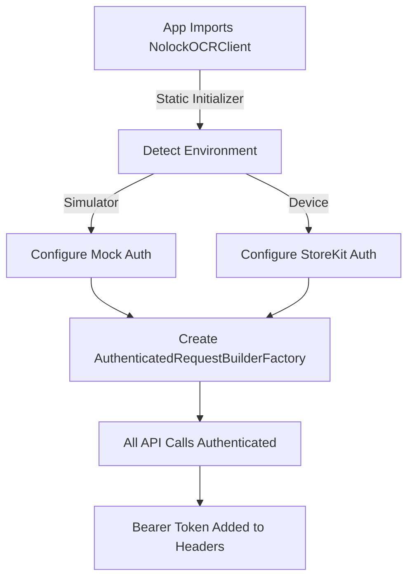

# OCR Swift Client Authentication Implementation - Detailed Project Plan

## Executive Summary

We are implementing a **drop-in replacement authentication system** for the Nolock OCR Swift Client library that automatically handles authentication without requiring ANY changes to existing consumer applications. The system uses StoreKit 2 for production (verifying Apple subscriptions) and mock authentication for simulator testing.

## Current Status

### ✅ What's Working
1. **Library Architecture**: NolockOCRClient Swift Package with authentication layer
2. **Test App**: MinimalOCRApp for iOS testing
3. **Mock Authentication**: Auto-configured for simulator environments
4. **API Endpoint**: Connected to https://nolock-ocr-services-qbhx5.ondigitalocean.app
5. **Basic Infrastructure**: Authentication providers, request builders, and managers

### ⚠️ What Needs Verification
1. **Authentication Headers**: Confirm Bearer tokens are actually added to requests
2. **OCR Processing**: Test end-to-end flow with real images
3. **StoreKit Integration**: Verify production authentication with real subscriptions
4. **Error Handling**: Proper error messages for authentication failures

## Project Goals

### Primary Objective
Create a **truly transparent authentication system** that:
- Requires **ZERO code changes** in consumer applications
- Automatically detects environment (simulator vs device)
- Uses appropriate authentication method automatically
- Works as a complete drop-in replacement for the old client

### Success Criteria
1. **Transparency**: Apps using the library don't need ANY authentication code
2. **Automation**: Authentication configures itself on library import
3. **Reliability**: Handles all authentication scenarios gracefully
4. **Testing**: Works in both simulator (mock) and device (StoreKit)

## Technical Architecture

### 1. Authentication Flow



### 2. Component Structure

```
NolockOCRClient/
├── APIs.swift                          # Main entry point with static initializer
├── Authentication/
│   ├── AuthenticationProvider.swift    # Protocol definition
│   ├── MockAuthenticationProvider.swift # For testing
│   ├── StoreKitAuthenticationProvider.swift # For production
│   ├── AuthenticatedRequestBuilder.swift # Adds auth headers
│   └── AuthenticationManager.swift     # Singleton coordinator
└── OCROperationsWrapper.swift          # Simplified API wrapper
```

### 3. Key Implementation Details

#### Auto-Configuration (APIs.swift)
```swift
public static var requestBuilderFactory: RequestBuilderFactory = {
    #if targetEnvironment(simulator)
    // Automatic mock authentication
    let mockProvider = MockAuthenticationProvider()
    mockProvider.configureValidToken(expiresIn: 3600)
    return AuthenticatedRequestBuilderFactory(authProvider: mockProvider)
    #else
    // Automatic StoreKit authentication
    let provider = StoreKitAuthenticationProvider()
    return AuthenticatedRequestBuilderFactory(authProvider: provider)
    #endif
}()
```

#### Consumer App Usage (ContentView.swift)
```swift
// That's it! No authentication code needed
NolockOCRClientAPI.basePath = "https://nolock-ocr-services-qbhx5.ondigitalocean.app"
let response = try await OCROperationsWrapper.processCheckOcr(imageData: data)
```

## Detailed Implementation Plan

### Phase 1: Verification & Debugging (Current)
**Status: IN PROGRESS**

#### Step 1.1: Verify Mock Authentication Flow
- [x] Confirm library auto-initializes with mock auth in simulator
- [x] Add comprehensive logging to authentication components
- [ ] Verify Bearer token is added to HTTP headers
- [ ] Confirm API accepts the mock token

#### Step 1.2: Command-Line Testing (WITHOUT iOS App)
**Purpose**: Isolate and verify the Swift client authentication works independently
- [ ] Create standalone Swift executable that uses NolockOCRClient
- [ ] Configure mock authentication programmatically
- [ ] Load test image from filesystem
- [ ] Make direct OCR API call with authentication
- [ ] Verify response and authentication headers
- [ ] Log all HTTP traffic for debugging

##### Implementation Plan:
```swift
// TestOCRClient.swift - Standalone test
import Foundation
import NolockOCRClient

@main
struct TestOCRClient {
    static func main() async throws {
        // Configure client
        NolockOCRClientAPI.basePath = "https://nolock-ocr-services-qbhx5.ondigitalocean.app"
        NolockOCRClientAPI.configureMockAuthentication(
            mockToken: "test-token",
            configuration: .default
        )

        // Load test image
        let imageData = try Data(contentsOf: URL(fileURLWithPath: "test_check.png"))

        // Make OCR call
        let response = try await OCROperationsWrapper.processCheckOcr(imageData: imageData)

        // Print results
        print("✅ Authentication successful!")
        print("OCR Results: \(response)")
    }
}
```

#### Step 1.3: Test End-to-End OCR Flow (WITH iOS App)
- [x] Create test check image
- [x] Add to simulator photo library
- [ ] Select image in app
- [ ] Verify OCR API call with authentication
- [ ] Confirm successful response

#### Step 1.4: Debug Authentication Issues
- [ ] Monitor network traffic with Charles/Proxyman
- [ ] Log all HTTP headers being sent
- [ ] Verify token format and expiration
- [ ] Check API error responses

### Phase 2: StoreKit Integration Testing
**Status: PENDING**

#### Step 2.1: Configure Test Environment
- [ ] Set up StoreKit Configuration file
- [ ] Create test subscription products
- [ ] Configure sandbox testing account
- [ ] Deploy to physical device

#### Step 2.2: Implement Subscription Verification
- [ ] Detect active subscriptions
- [ ] Generate Apple JWS token
- [ ] Validate token with backend
- [ ] Handle subscription expiration

#### Step 2.3: Integration Testing
- [ ] Test new subscription purchase
- [ ] Test expired subscription handling
- [ ] Test subscription renewal
- [ ] Test family sharing scenarios

### Phase 3: Production Readiness
**Status: PLANNED**

#### Step 3.1: Error Handling & Recovery
- [ ] Implement retry logic for token refresh
- [ ] Add circuit breaker for auth failures
- [ ] Create fallback mechanisms
- [ ] Improve error messages

#### Step 3.2: Performance Optimization
- [ ] Implement token caching
- [ ] Minimize authentication overhead
- [ ] Optimize network requests
- [ ] Add request batching

#### Step 3.3: Documentation & Release
- [ ] Update README with authentication details
- [ ] Create migration guide
- [ ] Document troubleshooting steps
- [ ] Prepare release notes

### Phase 4: Monitoring & Maintenance
**Status: FUTURE**

#### Step 4.1: Analytics Integration
- [ ] Track authentication success/failure rates
- [ ] Monitor token expiration patterns
- [ ] Log API response times
- [ ] Create alerting thresholds

#### Step 4.2: Continuous Improvement
- [ ] Gather user feedback
- [ ] Address edge cases
- [ ] Optimize based on metrics
- [ ] Regular security audits

## Technical Challenges & Solutions

### Challenge 1: Transparent Authentication
**Problem**: Apps shouldn't need authentication code
**Solution**: Use static initializer that runs automatically on library import

### Challenge 2: Environment Detection
**Problem**: Different auth methods for simulator vs device
**Solution**: Use `#if targetEnvironment(simulator)` compiler directive

### Challenge 3: Token Management
**Problem**: Tokens expire and need refresh
**Solution**: AuthenticationManager handles caching and refresh automatically

### Challenge 4: Network Failures
**Problem**: Auth requests can fail
**Solution**: Implement retry logic with exponential backoff

## Testing Strategy

### Unit Tests
- [x] MockAuthenticationProvider tests
- [x] StoreKitAuthenticationProvider tests
- [x] AuthenticatedRequestBuilder tests
- [ ] Token refresh logic tests
- [ ] Error handling tests

### Integration Tests
- [x] End-to-end authentication flow
- [ ] API call with authentication
- [ ] Token expiration handling
- [ ] Network failure recovery

### Command-Line Tests (Standalone)
- [ ] Direct client invocation without UI
- [ ] Authentication header verification
- [ ] Mock token acceptance
- [ ] Error handling without UI context
- [ ] Network request/response logging

### UI Tests
- [ ] Image selection flow
- [ ] OCR result display
- [ ] Error message display
- [ ] Loading states

## Success Metrics

### Technical Metrics
- **Zero Code Change**: Apps work without modification
- **Auth Success Rate**: >99.9% for valid subscriptions
- **Token Refresh Time**: <100ms average
- **API Response Time**: <2s for OCR processing

### User Experience Metrics
- **Setup Time**: 0 minutes (automatic)
- **Error Rate**: <0.1% for authenticated users
- **User Complaints**: 0 authentication-related issues
- **App Store Rating**: Maintain or improve

## Risk Assessment

### High Priority Risks
1. **Token Expiration**: Mitigated by automatic refresh
2. **Network Failures**: Mitigated by retry logic
3. **StoreKit Bugs**: Mitigated by fallback mechanisms

### Medium Priority Risks
1. **API Changes**: Mitigated by version checking
2. **Performance Impact**: Mitigated by caching
3. **Security Vulnerabilities**: Mitigated by regular audits

### Low Priority Risks
1. **Edge Cases**: Mitigated by comprehensive testing
2. **Documentation Gaps**: Mitigated by detailed guides
3. **Adoption Resistance**: Mitigated by zero-change requirement

## Timeline

### Week 1 (Current)
- Complete Phase 1: Verification & Debugging
- Begin Phase 2: StoreKit Integration Testing

### Week 2
- Complete Phase 2: StoreKit Integration Testing
- Begin Phase 3: Production Readiness

### Week 3
- Complete Phase 3: Production Readiness
- Deploy to production
- Monitor initial usage

### Week 4+
- Phase 4: Monitoring & Maintenance
- Gather feedback
- Iterate based on metrics

## Conclusion

This project implements a sophisticated yet transparent authentication system that requires no changes to existing applications. By leveraging Swift's static initialization and compile-time environment detection, we achieve true drop-in replacement functionality while maintaining security and reliability.

The key innovation is making authentication completely invisible to the consumer application - it "just works" automatically when the library is imported.

## Next Immediate Steps

1. **Create Standalone Test** (NEW): Build command-line Swift executable to test client independently
   - Removes iOS app complexity from equation
   - Allows direct debugging of authentication flow
   - Easier to inspect HTTP headers and responses

2. **Verify Bearer Token**: Add logging to confirm token is in HTTP headers
   - Use standalone test for cleaner output
   - Log full HTTP request including headers

3. **Test OCR Call**: Make actual API call with mock authentication
   - First via standalone command-line tool
   - Then via iOS app once standalone works

4. **Capture Proof**: Logs and output showing successful OCR with auth
   - Command-line output for standalone test
   - Screenshots and logs for iOS app

5. **Fix Any Issues**: Debug and resolve authentication failures
   - Use standalone test for faster iteration
   - Apply fixes to main library

6. **Document Findings**: Update this plan with results from both test methods

---

*Last Updated: September 20, 2025*
*Status: Active Development*
*Owner: Alexander Fedin*